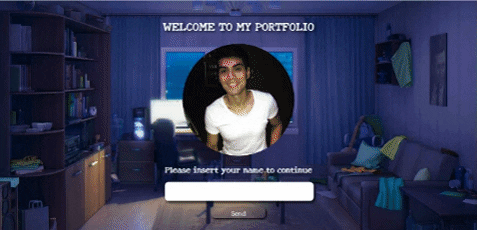

    
    <h2>Un poco sobre mi</h2>
    

    Mi nombre es Matias Flores tengo 29 años me recibi como Fullstack web developer en <a href="https://www.soyhenry.com/">Soy Henry</a> actualmente trabajando en relacion de dependencia para una empresa muy importante en argentina, en este lugar vas a encontrar repositorios de varias pruebas o ideas que se me ocurren a lo largo del tiempo con respecto a paginas web desarrolladas en javascript con o sin react si tienes alguna duda o quieres contactar conmigo te dejo mis redes al final
    

 

    
    <h2>Portfolio</h2>
     
    <a href="https://matias-flores.herokuapp.com/">Link</a>

<h2></h2>

     
    <a href="https://www.linkedin.com/in/matias-leandro-flores/">Linkedin</a> 
     floresmatias0@gmail.com

 

Iconos diseñados por <a href="https://www.freepik.com" title="Freepik">Freepik</a> from <a href="https://www.flaticon.es/" title="Flaticon">www.flaticon.es</a>

